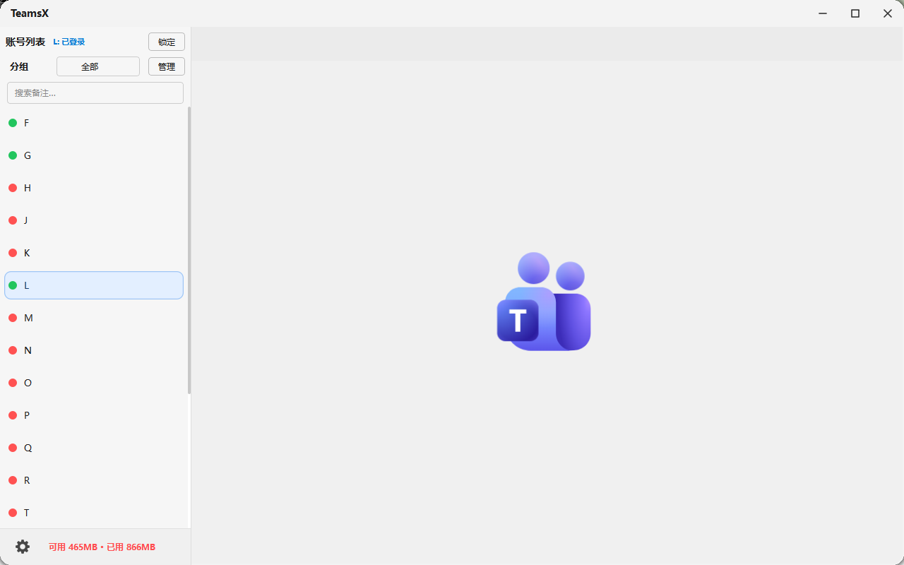
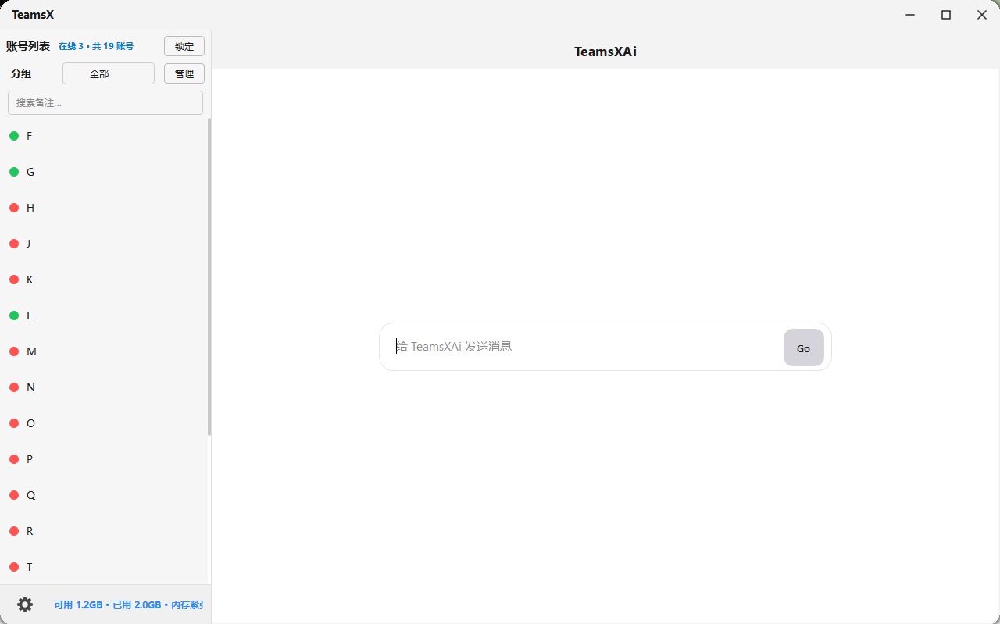

# TeamsX

Microsoft Teams 网页版多账号管理工具，基于 Edge WebView2 内核，在一个窗口内管理多个 Teams 账号，互不串号。





## 下载

| 方式 | 链接 |
|------|------|
| 安装包（推荐） | [TeamsX_Setup_2.2.0.exe](https://github.com/IMAF7/TeamsX/releases/latest/download/TeamsX_Setup_2.2.0.exe) |
| 下载页 | https://imaf7.github.io/TeamsX/download/ |
| 所有版本 | [GitHub Releases](https://github.com/IMAF7/TeamsX/releases) |

## 主要功能

- **多账号管理** — 独立登录态，左侧账号列表 + 右侧 Teams 网页
- **TeamsXAi** — 内置 DeepSeek 对话，与 Teams 隔离，按 `Esc` 回到 AI 主界面
- **消息通知** — 未读角标、网页提示音、来电铃声提醒
- **账号组织** — 分组、置顶、搜索备注、锁定侧栏
- **资源管理** — 并发上限、休眠/唤醒、缓存清理、内存监控

## 系统要求

- Windows 10 / 11（64 位）
- Microsoft Edge WebView2 Runtime（通常已随系统安装）
- 安装版无需 Python；数据默认保存在 `D:\TeamsX`

## 账号状态说明

| 圆点 | 含义 |
|------|------|
| 绿色 | 已登录且在活跃池 |
| 黄色 | 已登录但休眠（保留登录态） |
| 红色 | 未登录 / 登录失败 |

账号右侧红色数字为 Teams 未读消息数。

## 开发者

```powershell
cd 项目目录
.\setup_build_env.ps1   # 首次
python -m teamsx        # 启动
.\build.ps1             # 打包
.\publish_release.ps1   # 发布到 GitHub Releases
```

详见 [BUILD.md](BUILD.md)、[ENV.md](ENV.md)、[使用介绍.txt](使用介绍.txt)。

## 环境变量

| 变量 | 说明 |
|------|------|
| `TEAMSX_DATA_ROOT` | 数据目录，默认 `D:\TeamsX` |
| `TEAMSX_WEBVIEW2_BROWSER_FOLDER` | 固定版 WebView2 x64 运行时目录 |

## 许可证

本项目采用 [MIT License](LICENSE) 开源协议。
